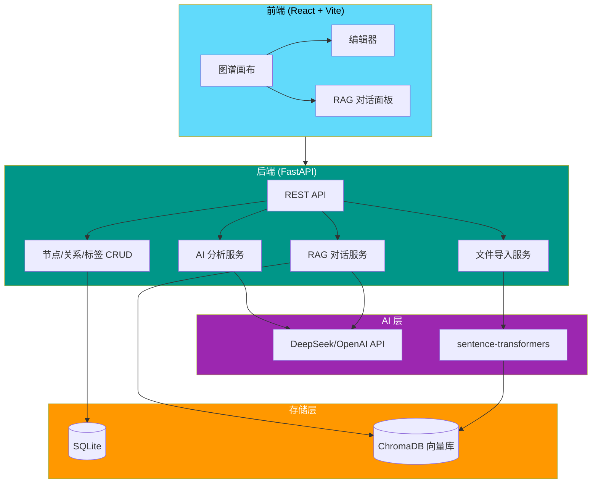

# Knowledge Base

**简体中文** | [English](./README.md)

---

AI 驱动的个人知识管理系统，支持知识图谱可视化、RAG 智能对话、笔记智能关联。

## 架构



## 功能特性

| 功能 | 说明 |
|------|------|
| **知识图谱** | 力导向图谱可视化，节点可拖拽、缩放，直观展示知识关系 |
| **AI 分析** | 自动提取笔记的摘要、分类、标签、重要性 |
| **RAG 对话** | 基于知识库内容的智能问答，支持引用溯源跳转 |
| **子知识点提取** | 自动提取 `##` 二级标题作为图谱子节点，支持跨笔记关联 |
| **Markdown 编辑** | 左右分栏编辑+实时预览 |
| **文件导入** | 支持 `.md`、`.txt`、`.docx` 单文件/批量导入 |
| **标签系统** | 彩色标签管理，按标签过滤，标签云展示 |
| **知识点关联** | 可以将不同笔记的具体知识点进行关联（不只是笔记级别） |

## 技术栈

| 层级 | 技术 |
|------|------|
| 后端 | FastAPI + SQLAlchemy + SQLite |
| 前端 | React + Vite |
| AI | DeepSeek / OpenAI 兼容 API |
| 向量数据库 | ChromaDB + sentence-transformers |
| 状态管理 | Zustand |

## 快速开始

```bash
# 1. 克隆仓库
git clone https://github.com/happiness-cheng/knowledge-base.git
cd knowledge-base

# 2. 安装后端依赖
cd backend
python -m venv venv
venv\Scripts\pip install -r requirements.txt

# 3. 配置 API Key（参考 ENVIRONMENT.md）
# 在 backend 目录下创建 .env 文件，填入：
#   AI_API_KEY=你的API Key
#   AI_BASE_URL=https://api.deepseek.com/v1
#   AI_MODEL_NAME=deepseek-chat

# 4. 安装前端依赖
cd ../frontend
npm install

# 5. 启动（Windows）
# 双击 start.bat，或在项目根目录执行：
cd ..
start.bat
```

浏览器自动打开 **http://localhost:5173**

## 使用指南

### 第一步：创建笔记
点击左上角 **+ 新建**，输入标题和 Markdown 内容，保存。

### 第二步：查看知识图谱
笔记会自动出现在画布上。点击节点展开详情面板。

### 第三步：AI 分析
点击节点详情中的 **AI 分析** 按钮，自动提取摘要、分类、标签。

### 第四步：关联知识点
点击图谱上的节点展开子知识点（`##` 标题），然后在详情面板点击 **+ 添加关联**，选择目标笔记的具体知识点进行关联。

### 第五步：RAG 对话
点击右上角 **Chat** 按钮，输入问题，AI 会基于知识库内容回答并标注引用来源。

## 项目结构

```
knowledge-base/
├── backend/
│   ├── app/
│   │   ├── routers/          # API 路由（nodes, tags, relationships, graph, ai, chat, import）
│   │   ├── models/           # SQLAlchemy 数据模型
│   │   ├── schemas/          # Pydantic 请求/响应模型
│   │   ├── services/         # 业务逻辑（AI 分析、RAG、文件导入）
│   │   └── utils/            # 工具函数（Markdown 清理）
│   └── tests/                # pytest 测试套件（114 个测试）
├── frontend/
│   └── src/
│       ├── components/       # React 组件（图谱、编辑器、对话、导入等）
│       ├── stores/           # Zustand 状态管理
│       ├── api/              # API 客户端
│       └── styles/           # CSS 样式
├── start.bat                 # 一键启动
├── ENVIRONMENT.md            # 环境配置说明
└── README.md                 # 本文件
```

## 测试

```bash
cd backend
venv/Scripts/python.exe -m pytest tests/ -v
```

114 个后端测试，覆盖 CRUD、关系、标签、图谱、子知识点提取、导入、对话。

## 贡献

欢迎提 Issue 和 Pull Request。

## 许可证

[MIT](./LICENSE)
